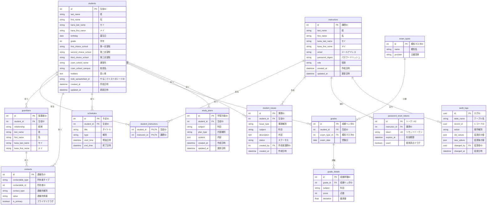

# DB スキーマ設計

## ER 図

```mermaid
erDiagram
    instructors {
        int id PK "講師ID"
        string last_name "姓"
        string first_name "名"
        string kana_last_name "セイ"
        string kana_first_name "メイ"
        string email "メールアドレス"
        string password_digest "パスワードハッシュ"
        string role "役割"
        datetime created_at "作成日時"
        datetime updated_at "更新日時"
    }

    students {
        int id PK "生徒ID"
        string last_name "姓"
        string first_name "名"
        string kana_last_name "セイ"
        string kana_first_name "メイ"
        date birthday "誕生日"
        int grade "学年"
        string first_choice_school "第一志望校"
        string second_choice_school "第二志望校"
        string third_choice_school "第三志望校"
        string cram_school_name "通塾先"
        string cram_school_campus "校舎名"
        text hobbies "習い事"
        string todo_spreadsheet_id "やることリストのシートID"
        datetime created_at "作成日時"
        datetime updated_at "更新日時"
    }

    guardians {
        int id PK "保護者ID"
        int student_id FK "生徒ID"
        string relationship "続柄"
        string last_name "姓"
        string first_name "名"
        string kana_last_name "セイ"
        string kana_first_name "メイ"
    }

    contacts {
        int id PK "連絡先ID"
        string contactable_type "所有者タイプ"
        int contactable_id "所有者ID"
        string contact_type "連絡先種別"
        string value "連絡先情報"
        boolean is_primary "プライマリフラグ"
    }

    student_instructors {
        int student_id PK, FK "生徒ID"
        int instructor_id PK, FK "講師ID"
    }

    password_reset_tokens {
        int id PK "トークンID"
        int instructor_id FK "講師ID"
        string token UK "リセットトークン"
        datetime expires_at "有効期限"
        boolean used "使用済みフラグ"
    }

    schedules {
        int id PK "予定ID"
        int student_id FK "生徒ID"
        string title "タイトル"
        string type "種別"
        datetime start_time "開始日時"
        datetime end_time "終了日時"
    }

    exam_types {
        int id PK "模試マスタID"
        string name "模試名"
        string provider "主催団体"
    }

    grades {
        int id PK "成績ヘッダID"
        int student_id FK "生徒ID"
        int exam_type_id FK "模試マスタID"
        date exam_date "受験日"
    }

    grade_details {
        int id PK "成績詳細ID"
        int grade_id FK "成績ヘッダID"
        string subject "科目"
        int score "点数"
        float deviation "偏差値"
    }

    study_plans {
        int id PK "学習計画ID"
        int student_id FK "生徒ID"
        string subject "科目"
        string plan_type "計画種別"
        text content "内容"
        datetime created_at "作成日時"
        datetime updated_at "更新日時"
    }

    student_issues {
        int id PK "課題ID"
        int student_id FK "生徒ID"
        string issue_type "課題種別"
        string subject "科目"
        text description "内容"
        string status "ステータス"
        int created_by FK "作成者講師ID"
        datetime created_at "作成日時"
    }

    instructors ||--o{ student_instructors : "担当"
    students ||--o{ student_instructors : "担当"
    students ||--o{ guardians : "持つ"
    students ||--o{ contacts : "持つ"
    guardians ||--o{ contacts : "持つ"
    students ||--o{ schedules : "持つ"
    students ||--o{ grades : "持つ"
    exam_types ||--o{ grades : "分類"
    grades ||--o{ grade_details : "詳細"
    students ||--o{ study_plans : "持つ"
    students ||--o{ student_issues : "持つ"
    instructors ||--o{ student_issues : "作成"
    instructors ||--o{ password_reset_tokens : "発行"

    audit_logs {
    uuid id PK "ログID"
    string table_name "テーブル名"
    uuid record_id "レコードID"
    string action "操作種別"
    json old_values "変更前の値"
    json new_values "変更後の値"
    uuid changed_by FK "変更者ID"
    datetime changed_at "変更日時"
}

instructors ||--o{ audit_logs : "実行"

```
