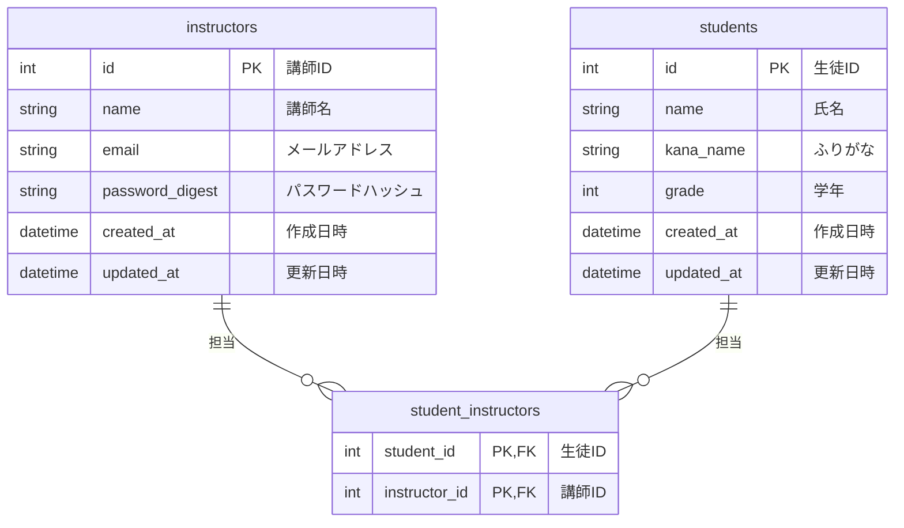

# DB スキーマ設計

## ER 図

```mermaid
erDiagram
    instructors {
        int id PK "講師ID"
        string name "講師名"
        string email "メールアドレス"
        string password_digest "パスワードハッシュ"
        datetime created_at "作成日時"
        datetime updated_at "更新日時"
    }

    students {
        int id PK "生徒ID"
        string name "氏名"
        string kana_name "ふりがな"
        int grade "学年"
        datetime created_at "作成日時"
        datetime updated_at "更新日時"
    }

    student_instructors {
        int student_id PK, FK "生徒ID"
        int instructor_id PK, FK "講師ID"
    }

    instructors ||--o{ student_instructors : "担当"
    students ||--o{ student_instructors : "担当"
```
