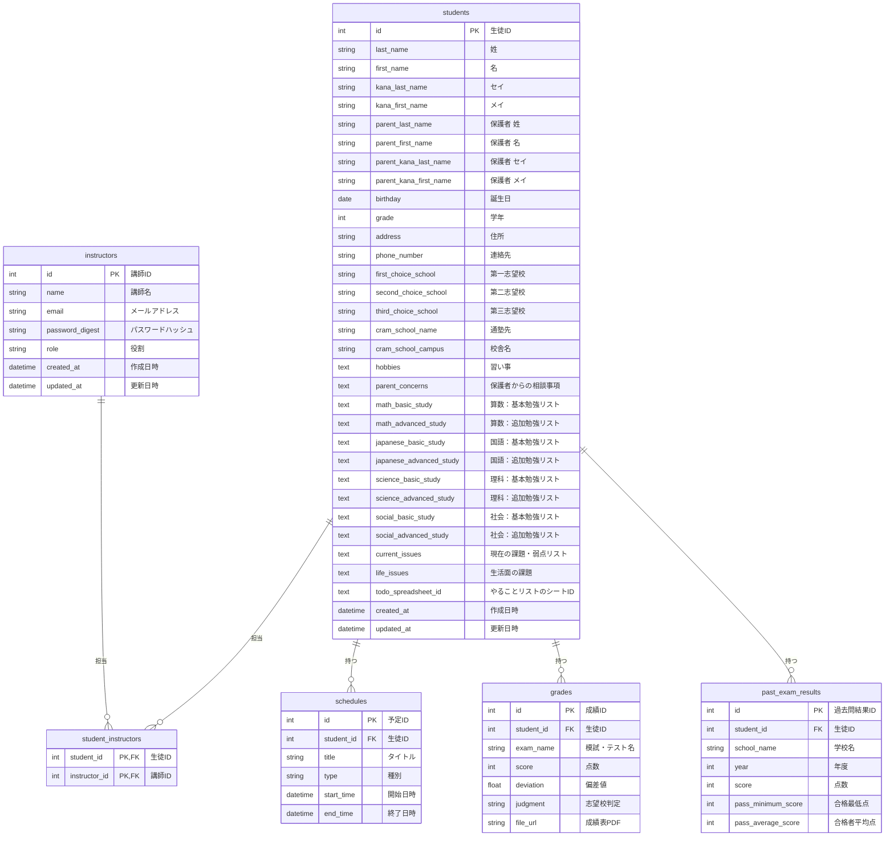

# DB スキーマ設計

## ER 図

```mermaid
erDiagram
    instructors {
        int id PK "講師ID"
        string name "講師名"
        string email "メールアドレス"
        string password_digest "パスワードハッシュ"
        string role "役割"
        datetime created_at "作成日時"
        datetime updated_at "更新日時"
    }

    students {
        int id PK "生徒ID"
        string last_name "姓"
        string first_name "名"
        string kana_last_name "セイ"
        string kana_first_name "メイ"
        string parent_last_name "保護者 姓"
        string parent_first_name "保護者 名"
        string parent_kana_last_name "保護者 セイ"
        string parent_kana_first_name "保護者 メイ"
        date birthday "誕生日"
        int grade "学年"
        string address "住所"
        string phone_number "連絡先"
        string first_choice_school "第一志望校"
        string second_choice_school "第二志望校"
        string third_choice_school "第三志望校"
        string cram_school_name "通塾先"
        string cram_school_campus "校舎名"
        text hobbies "習い事"
        text parent_concerns "保護者からの相談事項"
        text math_basic_study "算数：基本勉強リスト"
        text math_advanced_study "算数：追加勉強リスト"
        text japanese_basic_study "国語：基本勉強リスト"
        text japanese_advanced_study "国語：追加勉強リスト"
        text science_basic_study "理科：基本勉強リスト"
        text science_advanced_study "理科：追加勉強リスト"
        text social_basic_study "社会：基本勉強リスト"
        text social_advanced_study "社会：追加勉強リスト"
        text current_issues "現在の課題・弱点リスト"
        text life_issues "生活面の課題"
        text todo_spreadsheet_id "やることリストのシートID"
        datetime created_at "作成日時"
        datetime updated_at "更新日時"
    }

    schedules {
        int id PK "予定ID"
        int student_id FK "生徒ID"
        string title "タイトル"
        string type "種別"
        datetime start_time "開始日時"
        datetime end_time "終了日時"
    }

    grades {
        int id PK "成績ID"
        int student_id FK "生徒ID"
        string exam_name "模試・テスト名"
        int score "点数"
        float deviation "偏差値"
        string judgment "志望校判定"
        string file_url "成績表PDF"
    }

    past_exam_results {
        int id PK "過去問結果ID"
        int student_id FK "生徒ID"
        string school_name "学校名"
        int year "年度"
        int score "点数"
        int pass_minimum_score "合格最低点"
        int pass_average_score "合格者平均点"
    }

    instructors ||--o{ student_instructors : "担当"
    students ||--o{ student_instructors : "担当"
    students ||--o{ schedules : "持つ"
    students ||--o{ grades : "持つ"
    students ||--o{ past_exam_results : "持つ"

    student_instructors {
        int student_id PK, FK "生徒ID"
        int instructor_id PK, FK "講師ID"
    }

```
